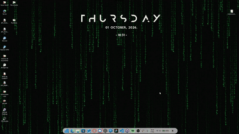

# Pip

O Pip é um mascote de código para Windows, com uma Dynamic Island interativa,
conversa com IA e integração com o VS Code. A arquitetura e os limites entre os
componentes estão descritos em [ARCHITECTURE.md](ARCHITECTURE.md).

## Demonstração



[Assistir ao vídeo completo com áudio (MP4)](https://raw.githubusercontent.com/kawe-keven/pip/pip-gitignore-only/media/pip-demo.mp4)

## Começar

### Aplicativo para Windows

Pré-requisito: Node.js com npm. Execute `pip.bat`; na primeira inicialização, o
script instala as dependências usando `npm ci` e abre o Pip. Configure o provedor
no menu da bandeja do sistema.

O Gemini é o provedor padrão. Para usá-lo, adicione uma chave em **Configurações**
ou defina `GEMINI_API_KEY`. O Alfred é opcional e deve estar ativo localmente em
`127.0.0.1:8000`.

### Extensão do VS Code

Instale [`extension/pip-vscode-0.2.9.vsix`](extension/pip-vscode-0.2.9.vsix) pelo
comando **Extensions: Install from VSIX...** na Paleta de Comandos (`Ctrl+Shift+P`)
e recarregue o VS Code. O overlay do Pip precisa estar aberto para responder.

## O que o Pip faz

- Mantém uma Dynamic Island no topo da tela. Clique para expandir e use a seta
	para recolher; passar o mouse não abre a ilha.
- Mostra faixa e artista da sessão de mídia ativa e anima o mascote de acordo com
	o estilo musical identificado.
- Abre uma conversa com o Pip; `Enter` envia, `Shift+Enter` cria uma nova linha e
	`Esc` fecha o chat. Uma solicitação em andamento pode ser cancelada.
- Recebe até três arquivos de texto ou código por arraste ou pelo botão de anexo.
	Cada arquivo pode ter até 256 KB e o total, até 512 KB.
- Oferece controles na bandeja do Windows para abrir o Pip, pausar aparições,
	acessar configurações ou sair.

## Usar no VS Code

- `Ctrl+Alt+P`: perguntar sobre o código selecionado ou o arquivo ativo.
- **Pip: Revisar seleção**: pedir uma revisão do código.
- Menu de contexto do editor: perguntar ou solicitar uma revisão da seleção.
- Chat do VS Code: mencione `@pip`; use `@pip /review` para revisar o arquivo
	aberto ou a seleção.

O contexto é limitado a 12.000 caracteres. No chat, referências adicionadas
explicitamente podem incluir até três arquivos.

## Provedores e configurações

O Pip aceita dois provedores:

| Provedor | Requisito | Uso |
| --- | --- | --- |
| Gemini | Chave configurada no Pip ou `GEMINI_API_KEY` | Respostas pela API Gemini; mantém até 12 pares recentes em memória durante a execução. |
| Alfred local | Serviço ativo em loopback, por padrão `127.0.0.1:8000` | Conversa, memória e agentes do Alfred; a conexão pode ser testada em Configurações. |

As configurações permitem selecionar o provedor e, no caso do Alfred, definir o
endereço e a sessão. `PIP_AI_PROVIDER`, `PIP_ALFRED_URL` e `PIP_ALFRED_SESSION`
podem substituir os valores da interface. O modelo Gemini padrão é
`gemini-3.5-flash`; altere-o com `PIP_MODEL`.

## Privacidade

- O código só é enviado quando você faz uma pergunta ou pede uma revisão. Os
	eventos automáticos do editor comunicam estado e diagnósticos, não o conteúdo
	dos arquivos.
- Arquivos anexados ficam em memória e só são enviados junto com uma pergunta
	explícita.
- A chave Gemini é armazenada com a proteção do Windows e não volta a ser exibida
	depois de salva.
- A ponte HTTP do Pip escuta somente em endereços locais e rejeita chamadas vindas
	de páginas web. No Windows, a extensão também pode usar o Named Pipe local.
- A extensão opcional do Claude Code observa estados da sessão; não encaminha
	prompts, comandos nem conteúdo de arquivos.

## Integração com Claude Code

Ative **Acompanhar sessões do Claude Code** em Configurações. O Pip faz backup de
`%USERPROFILE%\.claude\settings.json`, preserva as demais opções e remove apenas
os hooks pertencentes a ele quando a integração é desativada. A instalação
manual está descrita em
[`overlay/integrations/claude-code-hooks.json`](overlay/integrations/claude-code-hooks.json).

## Estrutura do projeto

```text
pip/
├── pip.bat                         # instala dependências e inicia o overlay
├── ARCHITECTURE.md                 # responsabilidades e contratos locais
├── extension/
│   ├── extension.js                # comandos, contexto e eventos do VS Code
│   └── bridge.js                   # transporte local entre extensão e Pip
└── overlay/
		├── main.js                     # janela, bandeja, IPC e servidores locais
		├── index.html                  # interface, chat e mascote em Canvas
		├── preload.js                  # API controlada para a interface
		├── settings-store.js           # persistência de configurações
		├── file-attachments.js         # validação e leitura de arquivos
		├── providers/                  # adaptadores Gemini e Alfred
		└── integrations/               # mídia, alertas e hooks externos
```

## Desenvolvimento

Para iniciar manualmente, abra um terminal na pasta `overlay` e execute:

```powershell
npm ci
npm start
```

Para desenvolver a extensão, abra `extension` no VS Code e pressione `F5` para
iniciar o Extension Development Host.
